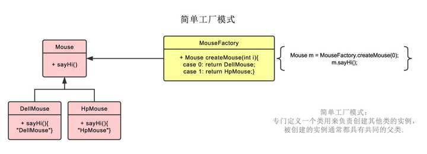
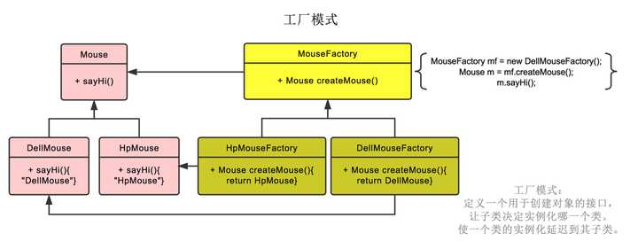
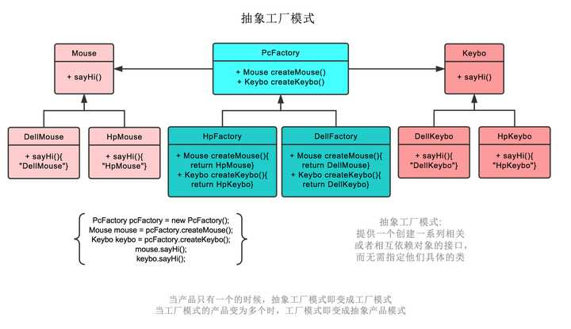
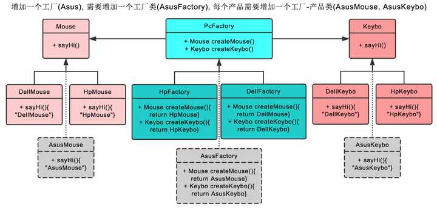
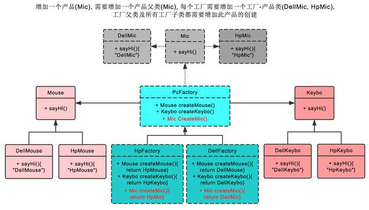

## 单例模式的实现

Singleton 模式通常有两种实现形式。

### 第 1 种：懒汉式单例

该模式的特点是类加载时没有生成单例，只有当第一次调用 getlnstance 方法时才去创建这个单例。代码如下：

```java
public class LazySingleton {
    private static volatile LazySingleton instance = null;    //保证 instance 在所有线程中同步

    private LazySingleton() {
    }    //private 避免类在外部被实例化

    public static synchronized LazySingleton getInstance() {
        //getInstance 方法前加同步
        if (instance == null) {
            instance = new LazySingleton();
        }
        return instance;
    }
}
```

注意：如果编写的是多线程程序，则不要删除上例代码中的关键字 volatile 和 synchronized，否则将存在线程非安全的问题。如果不删除这两个关键字就能保证线程安全，但是每次访问时都要同步，会影响性能，且消耗更多的资源，这是懒汉式单例的缺点。

### 第 2 种：饿汉式单例

该模式的特点是类一旦加载就创建一个单例，保证在调用 getInstance 方法之前单例已经存在了。

```java
public class HungrySingleton {
    private static final HungrySingleton instance = new HungrySingleton();

    private HungrySingleton() {
    }

    public static HungrySingleton getInstance() {
        return instance;
    }
}
```


饿汉式单例在类创建的同时就已经创建好一个静态的对象供系统使用，以后不再改变，所以是线程安全的，可以直接用于多线程而不会出现问题。

## 工厂模式

### 简单工厂模式

简单工厂模式不是23种里的一种，简而言之，就是有一个专门生产某个产品的类。  
比如下图中的鼠标工厂，专业生产鼠标，给参数0，生产戴尔鼠标，给参数1，生产惠普鼠标。  





### 工厂模式


工厂模式也就是鼠标工厂是个父类，有生产鼠标这个接口。  
戴尔鼠标工厂，惠普鼠标工厂继承它，可以分别生产戴尔鼠标，惠普鼠标。  
生产哪种鼠标不再由参数决定，而是创建鼠标工厂时，由戴尔鼠标工厂创建。  
后续直接调用鼠标工厂.生产鼠标()即可  




### 抽象工厂模式


抽象工厂模式也就是不仅生产鼠标，同时生产键盘。  
也就是PC厂商是个父类，有生产鼠标，生产键盘两个接口。  
戴尔工厂，惠普工厂继承它，可以分别生产戴尔鼠标+戴尔键盘，和惠普鼠标+惠普键盘。  
创建工厂时，由戴尔工厂创建。  
后续工厂.生产鼠标()则生产戴尔鼠标，工厂.生产键盘()则生产戴尔键盘。  




> ***在抽象工厂模式中，假设我们需要增加一个工厂***


假设我们增加华硕工厂，则我们需要增加华硕工厂，和戴尔工厂一样，继承PC厂商。  
之后创建华硕鼠标，继承鼠标类。创建华硕键盘，继承键盘类。  
即可。  




> ***在抽象工厂模式中，假设我们需要增加一个产品\***


假设我们增加耳麦这个产品，则首先我们需要增加耳麦这个父类，再加上戴尔耳麦，惠普耳麦这两个子类。  
之后在PC厂商这个父类中，增加生产耳麦的接口。最后在戴尔工厂，惠普工厂这两个类中，分别实现生产戴尔耳麦，惠普耳麦的功能。  
以上。  



