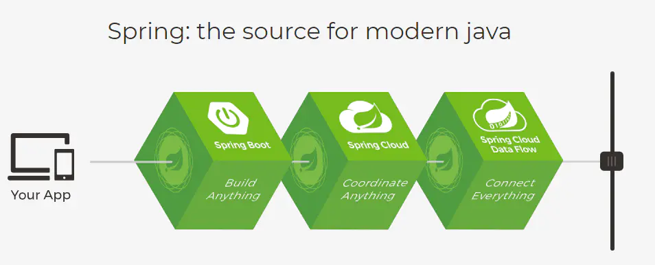
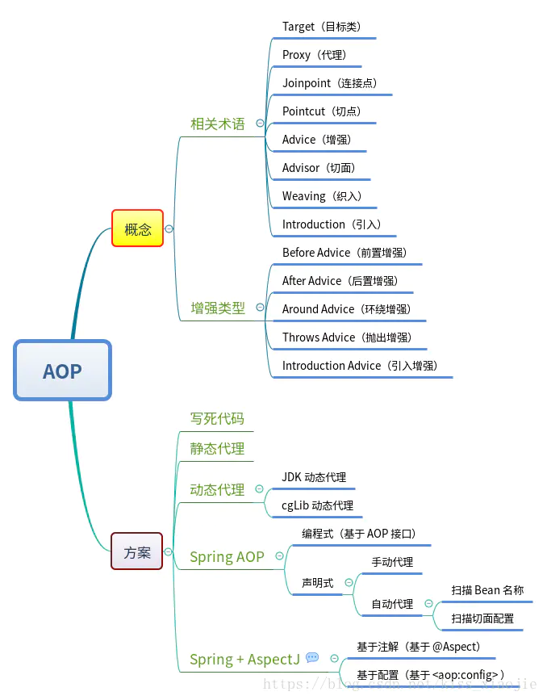

## Spring 和 SpringBoot 有什么不同？

#### 01

spring boot是spring的一个子项目，在依赖于spring的基础上进一步的简化开发，让开发者从配置文件中解放出来，采用约定优于配置。同时集成了很多三方的框架，让开发者整合其他组件更加简单。

------

#### 02

Spring框架为开发Java应用程序提供了全面的基础架构支持。它包含一些很好的功能，如依赖注入和开箱即用的模块，如：        Spring JDBC 、Spring MVC 、Spring Security、 Spring AOP 、Spring ORM 、Spring Test Spring Boot基本上是Spring框架的扩展，它消除了设置Spring应用程序所需的XML配置，为更快，更高效的开发生态系统铺平了道路。

------

#### 03 Spring Boot中的特点：

【01】创建独立的spring应用。

【02】嵌入Tomcat, Jetty Undertow 而且不需要部署他们。

【03】提供的“starters” poms来简化Maven配置

【04】尽可能自动配置spring应用。

【05】提供生产指标,健壮检查和外部化配置

【06】绝对没有代码生成和XML配置要求。

------

#### 04

Spring 框架提供多种特性使得 web 应用开发变得更简便，包括依赖注入、数据绑定、切面编程、数据存取等，SpringBoot 根据 classpath 中的 artifacts 的自动化配置应用程序提供非功能性特性例如安全和健康检查给到生产环境中的应用程序。

## spring aop 及实现方式

### 一、AOP的基本概念：

#### 1、什么是aop：

> - AOP（Aspect Oriented Programming）称为面向切面编程，在程序开发中主要用来解决一些系统层面上的问题，比如日志，事务，权限等待，Struts2的拦截器设计就是基于AOP的思想，是个比较经典的例子。
> - 在不改变原有的逻辑的基础上，增加一些额外的功能。代理也是这个功能，读写分离也能用aop来做。

> - AOP可以说是OOP（Object Oriented Programming，面向对象编程）的补充和完善。OOP引入封装、继承、多态等概念来建立一种对象层次结构，用于模拟公共行为的一个集合。不过OOP允许开发者定义纵向的关系，但并不适合定义横向的关系，例如日志功能。日志代码往往横向地散布在所有对象层次中，而与它对应的对象的核心功能毫无关系对于其他类型的代码，如安全性、异常处理和透明的持续性也都是如此，这种散布在各处的无关的代码被称为横切（cross cutting），在OOP设计中，它导致了大量代码的重复，而不利于各个模块的重用。

> - AOP技术恰恰相反，它利用一种称为"横切"的技术，剖解开封装的对象内部，并将那些影响了多个类的公共行为封装到一个可重用模块，并将其命名为"Aspect"，即切面。所谓"切面"，简单说就是那些与业务无关，却为业务模块所共同调用的逻辑或责任封装起来，便于减少系统的重复代码，降低模块之间的耦合度，并有利于未来的可操作性和可维护性。
> - 使用"横切"技术，AOP把软件系统分为两个部分：核心关注点和横切关注点。业务处理的主要流程是核心关注点，与之关系不大的部分是横切关注点。横切关注点的一个特点是，他们经常发生在核心关注点的多处，而各处基本相似，比如权限认证、日志、事物。AOP的作用在于分离系统中的各种关注点，将核心关注点和横切关注点分离开来。

#### 2、AOP的相关概念：

> (1)横切关注点：对哪些方法进行拦截，拦截后怎么处理，这些关注点称之为横切关注点
>  (2)Aspect(切面):通常是一个类，里面可以定义切入点和通知
>  (3)JointPoint(连接点):程序执行过程中明确的点，一般是方法的调用。被拦截到的点，因为Spring只支持方法类型的连接点，所以在Spring中连接点指的就是被拦截到的方法，实际上连接点还可以是字段或者构造器
>  (4)Advice(通知):AOP在特定的切入点上执行的增强处理，有before(前置),after(后置),afterReturning(最终),afterThrowing(异常),around(环绕)
>  (5)Pointcut(切入点):就是带有通知的连接点，在程序中主要体现为书写切入点表达式
>  (6)weave(织入)：将切面应用到目标对象并导致代理对象创建的过程
>  (7)introduction(引入)：在不修改代码的前提下，引入可以在**运行期**为类动态地添加一些方法或字段
>  (8)AOP代理(AOP Proxy)：AOP框架创建的对象，代理就是目标对象的加强。Spring中的AOP代理可以使JDK动态代理，也可以是CGLIB代理，前者基于接口，后者基于子类
>  (9)目标对象（Target Object）: 包含连接点的对象。也被称作被通知或被代理对象。POJO

#### 3、Advice通知类型介绍：

(1)Before:在目标方法被调用之前做增强处理,@Before只需要指定切入点表达式即可

(2)AfterReturning:在目标方法正常完成后做增强,@AfterReturning除了指定切入点表达式后，还可以指定一个返回值形参名returning,代表目标方法的返回值

(3)AfterThrowing:主要用来处理程序中未处理的异常,@AfterThrowing除了指定切入点表达式后，还可以指定一个throwing的返回值形参名,可以通过该形参名

来访问目标方法中所抛出的异常对象

(4)After:在目标方法完成之后做增强，无论目标方法时候成功完成。@After可以指定一个切入点表达式

(5)Around:环绕通知,在目标方法完成前后做增强处理,环绕通知是最重要的通知类型,像事务,日志等都是环绕通知,注意编程中核心是一个ProceedingJoinPoint

#### 4、AOP使用场景：

> *Authentication 权限*
>
>  *Caching 缓存*
>
>  *Context passing 内容传递*
>
>  *Error handling 错误处理*
>
>  *Lazy loading　懒加载*
>
>  *Debugging　　调试*
>
>  *logging, tracing, profiling and monitoring　记录跟踪　优化　校准*
>
>  *Performance optimization　性能优化*
>
>  *Persistence　　持久化*
>
>  *Resource pooling　资源池*
>
>  *Synchronization　同步*
>
>  *Transactions 事务*

### 二、使用AOP的几种方式:

> 1.经典的基于代理的AOP
>
> 2.@AspectJ注解驱动的切面
>
> 3.纯POJO切面（纯粹通过< aop:fonfig >标签配置）
>
> 4.注入式AspectJ切面