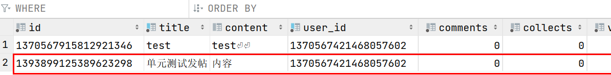

## 可以对别人的帖子进行编辑和删除吗？

答：不能

登陆成功之后token放到结果集里面，会传给前端

```java
map.put("token", token);
return ApiResult.success(map, "登录成功");
	
/**
     * 成功
     *
     * @param data    结果集
     * @param message 自定义提示信息
     * @return {code:200,message:自定义,data:自定义}
     */
public static <T> ApiResult<T> success(T data, String message) {
    return new ApiResult<T>(ApiErrorCode.SUCCESS.getCode(), message, data);
}
```


前端判断是否登录，并且判断一下登录的用户id是否和当前帖子的id一致。不一致的话前端直接不显示更新和编辑。

```vue
<div
     v-if="token && user.id === topicUser.id"
     class="level-right"
     >
```


## 删除帖子的一些问题

删除帖子也涉及到多张表的修改，有帖子表，评论表，表签表，帖子标签关联表，事务。


## 单元测试

### 用户信息的单元测试

```java
@Autowired
IUmsUserService UmsUserService;

@Test
void umsUserServiceTest() {
    ProfileVO profileVO = UmsUserService.getUserProfile("1370567421468057602");
    System.out.println("用户名" + profileVO.getUsername());
    System.out.println("帖子数量" + profileVO.getTopicCount());
}
```

输出：

```java
用户名admin
帖子数量1
```


### 发表帖子的单元测试

```java
@Autowired
IBmsPostService bmsPostService;

// 发表帖子的单元测试
@Test
void test(){
    // 获取所有帖子，遍历打印帖子id
    Page<PostVO> list = bmsPostService.getList(new Page<>(1, 10), "latest");
    list.getRecords().forEach(postVO -> {
        System.out.println("帖子id: " + postVO.getId());
        System.out.println("帖子标签: " + postVO.getTags());
    });
    
    输出：
        /**
         * 帖子id: 1370567915812921346
         * 帖子标签: [BmsTag(id=1370567915880030209, name=test, topicCount=1)]
         */
}
```

```java
// 发帖测试
List tags = new ArrayList<String>();
tags.add("单元测试");
tags.add("发帖");
UmsUser user = new UmsUser();
user.setId("1370567421468057602");
CreateTopicDTO createTopicDTO = new CreateTopicDTO("单元测试发帖", "内容", tags);
BmsPost bmsPost = bmsPostService.create(createTopicDTO, user);
```

测试成功！！



## 怎么实现的监管者授权功能？

简历表加了一个字段，select count(角色) from 用户表 where 角色 = '监管者'，判断监管者的数量是否等于这个字段值。

