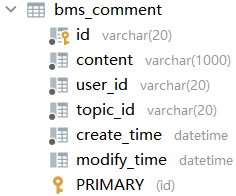
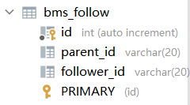
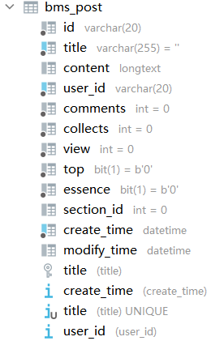
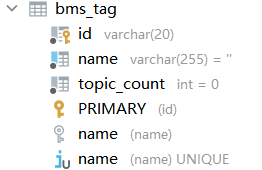
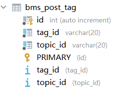
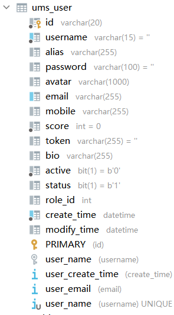

主要的一些表

## 1.评论表（bms_comment）

有id，帖子id，用户id，评论内容，创建时间，修改时间。‘

## 2.关注表

有id，被关注者id，关注者id

## 3.帖子表

主要的是标题，内容，用户名

标题使用了唯一索引，保证列值的不重复

## 4.标签表

有标签名字，此标签下的帖子总数

标签名字使用了唯一索引，保证列值的不重复

## 5.帖子-标签关联表

有帖子id，标签id

## 6.用户表

主要有用户名，密码，积分，token